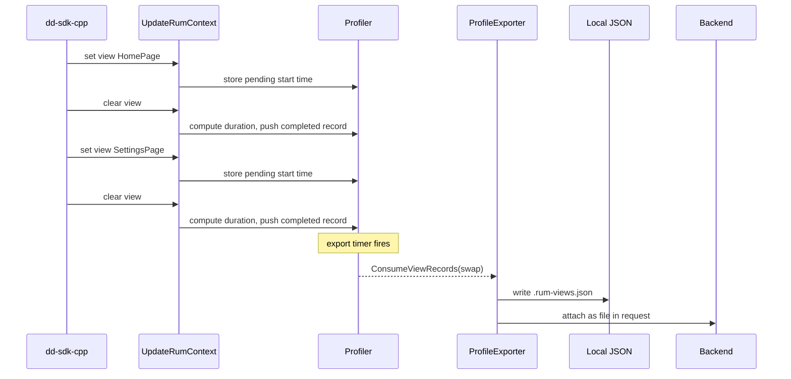

# RUM View Timeline JSON

## Context

When `UpdateRumContext` is called with a non-empty `view_id`, we record a timestamped entry. At each profile export, these entries are serialized to JSON and emitted two ways:

- **Local**: `{prefix}{timestamp}.rum-views.json` alongside the `.lz4.pprof` file
- **HTTP**: attached via the libdatadog `files_to_compress_and_export` parameter in `ddog_prof_Exporter_Request_build`

The JSON format per the spec (`relative` always 0, `timeStamp` in milliseconds since Unix epoch, `duration` in milliseconds):

```json
[
  {"startClocks":{"relative":0,"timeStamp":1773058873970},"duration":2000,"viewId":"...","viewName":"..."},
  ...
]
```

## Data flow




## Step 1 -- Add `RumViewRecord` struct and provider interface

**File**: [src/dd-win-prof/RumContext.h](src/dd-win-prof/RumContext.h)

Add below the existing `RumViewContext` struct:

```cpp
struct RumViewRecord {
    int64_t timestamp_ms;  // milliseconds since Unix epoch (view start)
    int64_t duration_ms;   // view duration in milliseconds
    std::string view_id;
    std::string view_name;
};
```

Add a new provider interface (separate from `IRumViewContextProvider` to keep `StackSamplerLoop` decoupled):

```cpp
class IRumViewRecordProvider {
public:
    virtual ~IRumViewRecordProvider() = default;
    virtual void ConsumeViewRecords(std::vector<RumViewRecord>& records) = 0;
};
```

`ConsumeViewRecords()` swaps the internal buffer into the caller-provided vector (O(1), no copy, no allocation if the caller reuses the vector across export cycles) and clears the internal buffer.

## Step 2 -- Record view events in Profiler

**Files**: [src/dd-win-prof/Profiler.h](src/dd-win-prof/Profiler.h), [src/dd-win-prof/Profiler.cpp](src/dd-win-prof/Profiler.cpp)

- `Profiler` inherits `IRumViewRecordProvider` (in addition to the existing `IRumViewContextProvider`).
- New private members (protected by `_rumViewMutex`, which already guards view state):

```cpp
std::vector<RumViewRecord> _completedViewRecords;
int64_t _pendingViewStartMs{0};
bool _hasPendingView{false};
```

- In `UpdateRumContext()`, inside the existing `std::unique_lock lock(_rumViewMutex)` block:
  - **When a view is set** (non-empty `view_id`): record `_pendingViewStartMs = now_epoch_ms`, set `_hasPendingView = true`. This is done right after setting `_currentRumView`.
  - **When a view is cleared** (empty/null `view_id`): if `_hasPendingView`, compute the duration and finalize the record:

```cpp
auto nowMs = std::chrono::duration_cast<std::chrono::milliseconds>(
    std::chrono::system_clock::now().time_since_epoch()).count();
_completedViewRecords.push_back({
    _pendingViewStartMs,
    nowMs - _pendingViewStartMs,
    std::move(_currentRumView.view_id),
    std::move(_currentRumView.view_name)
});
_hasPendingView = false;
```

  This is done in the `else` branch (clear path), before clearing `_currentRumView`.

- Implement `ConsumeViewRecords()` using swap (O(1), no copy):

```cpp
void Profiler::ConsumeViewRecords(std::vector<RumViewRecord>& records) {
    std::unique_lock lock(_rumViewMutex);
    _completedViewRecords.swap(records);
}
```

The caller provides a vector that gets swapped with the internal buffer. After the swap, the caller owns the completed records and the internal buffer is empty (it holds the caller's old -- presumably empty -- vector). Across export cycles the caller reuses the same vector, so no repeated heap allocations.

## Step 3 -- Pass the provider to ProfileExporter via constructor

**Files**: [src/dd-win-prof/ProfileExporter.h](src/dd-win-prof/ProfileExporter.h), [src/dd-win-prof/ProfileExporter.cpp](src/dd-win-prof/ProfileExporter.cpp), [src/dd-win-prof/Profiler.cpp](src/dd-win-prof/Profiler.cpp)

- Add `IRumViewRecordProvider`* as a constructor parameter to `ProfileExporter` (stored in a private `_pRumViewRecordProvider` member):

```cpp
ProfileExporter(Configuration* pConfiguration,
                std::span<const SampleValueType> sampleTypeDefinitions,
                IRumViewRecordProvider* pRumViewRecordProvider = nullptr);
```

- In `Profiler::StartProfiling()`, pass `this` when constructing the exporter:

```cpp
_pProfileExporter = std::make_unique<ProfileExporter>(
    _pConfiguration.get(), sampleTypeDefinitions, this);
```

- Also add a `std::vector<RumViewRecord> _viewRecordsBuffer` member to `ProfileExporter`, reused across exports as the swap target for `ConsumeViewRecords()`.

## Step 4 -- Serialize view records to JSON

**File**: [src/dd-win-prof/ProfileExporter.cpp](src/dd-win-prof/ProfileExporter.cpp)

Add a private helper method:

```cpp
std::string ProfileExporter::SerializeViewRecordsToJson(
    const std::vector<RumViewRecord>& records)
```

Use `std::ostringstream` to avoid repeated string reallocations and unnecessary copies:

```cpp
std::ostringstream ss;
ss << '[';
for (size_t i = 0; i < records.size(); ++i) {
    if (i > 0) ss << ',';
    ss << "{\"startClocks\":{\"relative\":0,\"timeStamp\":"
       << records[i].timestamp_ms
       << "},\"duration\":" << records[i].duration_ms
       << ",\"viewId\":\"";
    EscapeJsonString(ss, records[i].view_id);
    ss << "\",\"viewName\":\"";
    EscapeJsonString(ss, records[i].view_name);
    ss << "\"}";
}
ss << ']';
return ss.str();
```

Add a minimal `EscapeJsonString(std::ostream& out, const std::string& s)` helper that writes directly to the stream, escaping `\`, `"`, and control characters since view IDs/names come from external input.

## Step 5 -- Write local JSON file and attach to HTTP export

**File**: [src/dd-win-prof/ProfileExporter.cpp](src/dd-win-prof/ProfileExporter.cpp)

### 5a. In `Export()`

After serializing the profile and before calling `WritePprofFile` / `ExportProfile`, consume the view records into the reusable `_viewRecordsBuffer` member and serialize them:

```cpp
std::string viewRecordsJson;
if (_pRumViewRecordProvider != nullptr) {
    _pRumViewRecordProvider->ConsumeViewRecords(_viewRecordsBuffer);
    if (!_viewRecordsBuffer.empty()) {
        viewRecordsJson = SerializeViewRecordsToJson(_viewRecordsBuffer);
        _viewRecordsBuffer.clear();
    }
}
```

Pass `viewRecordsJson` to both the local and HTTP export paths.

### 5b. Local file: `WriteViewRecordsFile()`

New private method alongside `WritePprofFile`. Uses the same timestamp-based naming but with suffix `.rum-views.json`:

- Filename: `{_debugPprofPrefix}{timestamp}.rum-views.json`
(e.g. `profile_20260312T100000Z.rum-views.json`)
- Called from `Export()` inside the **same `if` block** as `WritePprofFile` (i.e. `if (_debugPprofFileWritingEnabled && !_debugPprofPrefix.empty())`), only when `viewRecordsJson` is non-empty.
- Writes the JSON string to the file.

### 5c. HTTP export: attach via `files_to_compress_and_export`

Modify `ExportProfile()` to accept the JSON string and, when non-empty, build a `ddog_prof_Exporter_File` pointing to it:

```cpp
ddog_prof_Exporter_File viewFile;
viewFile.name = to_CharSlice("rum-views.json");
viewFile.file = {
    reinterpret_cast<const uint8_t*>(json.data()),
    json.size()
};
ddog_prof_Exporter_Slice_File files = { &viewFile, 1 };
```

Replace the first `ddog_prof_Exporter_Slice_File_empty()` in the call to `ddog_prof_Exporter_Request_build` (line 1123) with this slice. When no records, keep the empty slice.

## Step 6 -- Update Runner scenario 5

**File**: [src/Runner/Runner.cpp](src/Runner/Runner.cpp)

No code changes needed. `RunRumScenario` already calls `SetView`/`ClearView` with three views and a gap, which will produce three `RumViewRecord` entries.

## Step 7 -- Unit tests

**File**: [src/Tests/RumContextTests.cpp](src/Tests/RumContextTests.cpp)

Add tests covering:

- `RumViewRecord` default construction and value initialization
- `Profiler::ConsumeViewRecords()` returns empty (via swap) when no views have been set
- Setting a view and then clearing it produces one completed record:
  - Assert `timestamp_ms` is within a reasonable range of `now()`
  - Assert `duration_ms` is approximately the elapsed time between set and clear
  - Assert `view_id` and `view_name` match
- Consume swaps the buffer: second call returns empty
- Setting a view without clearing does NOT produce a completed record (view is still pending)
- Clearing a view that was never set produces no record
- View transitions (clear + set + clear) produce exactly one record per completed view
- `ProfileExporter::SerializeViewRecordsToJson()` produces valid JSON matching the spec format including `duration` field (test with 0, 1, and multiple records)
- `EscapeJsonString` handles `\`, `"`, and control characters

## Step 8 -- Integration tests

**Files**: [src/integration-tests/test_rum_scenario.ps1](src/integration-tests/test_rum_scenario.ps1), [src/integration-tests/pprof_utils.py](src/integration-tests/pprof_utils.py)

### 8a. Extend test_rum_scenario.ps1

After the existing pprof assertions, add:

- Find `.rum-views.json` files in the temp pprof directory
- Assert at least one exists
- Parse JSON content (`ConvertFrom-Json`)
- Assert exactly 3 entries per iteration (6 for `--iterations 2`)
- Assert each entry has `startClocks.relative == 0` and `startClocks.timeStamp` > 0 (valid ms-since-Unix-epoch)
- Assert each entry has `duration` > 0 (each view in scenario 5 runs for at least 2 seconds)
- Assert viewId/viewName pairs match the three views from scenario 5:
  - `11111111-...-111111111111` / `HomePage`
  - `22222222-...-222222222222` / `SettingsPage`
  - `33333333-...-333333333333` / `ProfilePage`

### 8b. No changes needed to pprof_utils.py

The JSON file is plain JSON, directly parseable by PowerShell's `ConvertFrom-Json`. No Python helper needed.

## Step 9 -- Documentation updates

- [src/integration-tests/README.md](src/integration-tests/README.md): update test inventory table to mention `.rum-views.json` validation
- [src/Runner/README.md](src/Runner/README.md): mention that scenario 5 also produces a `.rum-views.json` file when `--pprofdir` is set
- [README.md](README.md): no changes needed (already references integration tests)

## Step 10 -- Build system

- [src/dd-win-prof/dd-win-prof.vcxproj](src/dd-win-prof/dd-win-prof.vcxproj) / [.filters](src/dd-win-prof/dd-win-prof.vcxproj.filters): no new files to add (changes are in existing files)
- [src/Tests/CMakeLists.txt](src/Tests/CMakeLists.txt) / [Tests.vcxproj](src/Tests/Tests.vcxproj): no new test files (tests go in existing `RumContextTests.cpp`)
- `framework.h`: already includes `<shared_mutex>` and `<vector>`; may need `<chrono>` in `RumContext.h` (check)

