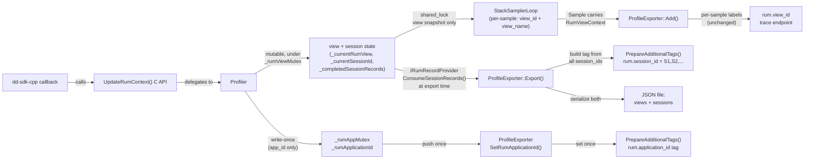


# Make `session_id` Mutable During Application Lifetime

## Context

The current implementation assumes both `application_id` and `session_id` are "set once" and rejects calls with different values ([Key Assumption #1](plans/rum_context_phase_1.plan.md), line 38). In reality, `session_id` can change (e.g., session expiration/rotation). This plan removes the write-once constraint on `session_id` while keeping `application_id` write-once.

## Design Decisions

- **No per-sample `rum.session_id` label.** Session identity is not propagated to individual samples.
- **Profile-level `rum.session_id` tag** contains a **comma-separated list** of all session_ids that were active since the last export (completed sessions + ongoing session).
- **Session timeline records** (timestamp + duration + session_id) are tracked in `Profiler` using the same pattern as view records, and written to the **same `.rum-views.json` file** alongside view records.
- `**RumViewContext` is unchanged** -- it remains view-only (`view_id` + `view_name`). `GetCurrentViewContext()` semantics are unchanged.
- **No synchronization needed in `ProfileExporter`** for session_id -- session data is consumed from records at export time (same thread), not pushed from another thread.

## Data Flow (updated)




---

## Step 1: Add `RumSessionRecord`, rename and extend provider in [RumContext.h](src/dd-win-prof/RumContext.h)

### 1a. New struct

```cpp
struct RumSessionRecord {
    int64_t timestamp_ms{0};   // milliseconds since Unix epoch (session start)
    int64_t duration_ms{0};    // session duration in milliseconds (0 if still ongoing)
    std::string session_id;
};
```

### 1b. Rename `IRumViewRecordProvider` to `IRumRecordProvider` and add session methods

The interface now provides both view and session records, so the name should reflect that:

```cpp
class IRumRecordProvider {
public:
    virtual ~IRumRecordProvider() = default;

    virtual void ConsumeViewRecords(std::vector<RumViewRecord>& records) = 0;

    // Swaps the internal completed-session buffer into 'records'.
    virtual void ConsumeSessionRecords(std::vector<RumSessionRecord>& records) = 0;

    // Returns the currently active session_id (may be empty if no session set yet).
    virtual std::string GetCurrentSessionId() const = 0;
};
```

This rename propagates to:

- `Profiler.h`: class declaration changes from `public IRumViewRecordProvider` to `public IRumRecordProvider`
- `ProfileExporter.h`: constructor parameter and member change from `IRumViewRecordProvider*` to `IRumRecordProvider*`

### 1c. No changes to `RumViewContext` or `RumViewRecord`

`RumViewContext` stays as-is (view_id + view_name). `RumViewRecord` stays as-is. Per-sample labeling is unchanged.

---

## Step 2: Refactor `Profiler` for mutable session tracking

### 2a. [Profiler.h](src/dd-win-prof/Profiler.h) member changes

Remove the session_id from the app-level write-once block. Add session timeline tracking alongside the existing view tracking (all under `_rumViewMutex`):

```cpp
// RUM app-level ID (write-once, buffered until exporter exists)
std::mutex _rumAppMutex;
bool _rumAppIdSet{false};            // was: _rumAppIdsSet
std::string _rumApplicationId;
// REMOVED: _rumSessionId  (session_id now tracked below)

// RUM session tracking (protected by _rumViewMutex alongside view state)
std::string _currentSessionId;
int64_t _sessionStartMs{0};
bool _hasPendingSession{false};
std::vector<RumSessionRecord> _completedSessionRecords;
```

Add the new interface methods:

```cpp
// IRumRecordProvider implementation
void ConsumeViewRecords(std::vector<RumViewRecord>& records) override;
void ConsumeSessionRecords(std::vector<RumSessionRecord>& records) override;
std::string GetCurrentSessionId() const override;
```

### 2b. [Profiler.cpp](src/dd-win-prof/Profiler.cpp) `UpdateRumContext()` rewrite

The method body is restructured into two independent blocks:

**Block 1 -- application_id (under `_rumAppMutex`, write-once):**

- If `application_id` is non-empty and not yet set: store it, push to exporter via `SetRumApplicationId()`
- If already set and different: return `false` (reject the entire call)
- If same or empty: no-op

```cpp
{
    std::lock_guard lock(_rumAppMutex);
    bool hasAppId = pContext->application_id != nullptr && pContext->application_id[0] != '\0';
    if (hasAppId)
    {
        if (_rumAppIdSet && _rumApplicationId != pContext->application_id)
        {
            return false;  // different application_id rejected
        }
        if (!_rumAppIdSet)
        {
            _rumApplicationId = pContext->application_id;
            _rumAppIdSet = true;
            if (_pProfileExporter != nullptr)
            {
                _pProfileExporter->SetRumApplicationId(_rumApplicationId);
            }
        }
    }
}
```

**Block 2 -- session_id + view (under `_rumViewMutex`, mutable):**

Session tracking follows the same start/complete pattern as view tracking:

```cpp
{
    std::unique_lock lock(_rumViewMutex);

    // --- Session tracking ---
    bool hasSessionId = pContext->session_id != nullptr && pContext->session_id[0] != '\0';
    if (hasSessionId && _currentSessionId != pContext->session_id)
    {
        // Complete the previous session record (if any)
        if (_hasPendingSession)
        {
            auto nowMs = std::chrono::duration_cast<std::chrono::milliseconds>(
                std::chrono::system_clock::now().time_since_epoch()).count();
            _completedSessionRecords.push_back({
                _sessionStartMs,
                nowMs - _sessionStartMs,
                std::move(_currentSessionId)
            });
        }

        // Start new session
        _currentSessionId = pContext->session_id;
        _sessionStartMs = std::chrono::duration_cast<std::chrono::milliseconds>(
            std::chrono::system_clock::now().time_since_epoch()).count();
        _hasPendingSession = true;
    }

    // --- View tracking (existing logic, unchanged) ---
    if (pContext->view_id != nullptr && pContext->view_id[0] != '\0')
    {
        // ... set view (existing code) ...
    }
    else
    {
        // ... clear view (existing code) ...
    }
}
```

### 2c. Implement `ConsumeSessionRecords()` and `GetCurrentSessionId()`

```cpp
void Profiler::ConsumeSessionRecords(std::vector<RumSessionRecord>& records)
{
    std::unique_lock lock(_rumViewMutex);
    _completedSessionRecords.swap(records);
}

std::string Profiler::GetCurrentSessionId() const
{
    std::shared_lock lock(_rumViewMutex);
    return _currentSessionId;
}
```

### 2d. `StartProfiling()` -- flush only application_id

Session_id no longer needs to be pushed to the exporter (it's consumed from records at export time):

```cpp
{
    std::lock_guard lock(_rumAppMutex);
    if (_rumAppIdSet)
    {
        _pProfileExporter->SetRumApplicationId(_rumApplicationId);
    }
}
```

### 2e. `GetCurrentViewContext()` -- unchanged

View-only semantics are preserved. Returns `true` only when a view is active. No session_id in the per-sample snapshot.

---

## Step 3: Refactor `ProfileExporter` for session records and tag

### 3a. [ProfileExporter.h](src/dd-win-prof/ProfileExporter.h)

**Replace** `SetRumApplicationTags(appId, sessionId)` with:

```cpp
void SetRumApplicationId(const std::string& applicationId);  // set once, no sync needed
```

**Remove** `_rumSessionId` member. Session_id is now collected from records at export time (no cross-thread mutation).

**Add** session record buffer:

```cpp
std::vector<RumSessionRecord> _sessionRecordsBuffer;
```

**Update** `SerializeViewRecordsToJson` signature to include sessions:

```cpp
static std::string SerializeRumRecordsToJson(
    const std::vector<RumViewRecord>& viewRecords,
    const std::vector<RumSessionRecord>& sessionRecords);
```

**No changes** to `SampleLabels`, `CreateLabelSet`, or per-sample labeling.

### 3b. [ProfileExporter.cpp](src/dd-win-prof/ProfileExporter.cpp) -- Export flow

In `Export()`, after consuming view records (around line 244), also consume session records and the current session_id:

```cpp
// Consume RUM view and session records
std::string rumRecordsJson;
std::string currentSessionId;
std::vector<std::string> allSessionIds;

if (_pRumRecordProvider != nullptr)
{
    _pRumRecordProvider->ConsumeViewRecords(_viewRecordsBuffer);
    _pRumRecordProvider->ConsumeSessionRecords(_sessionRecordsBuffer);
    currentSessionId = _pRumRecordProvider->GetCurrentSessionId();

    // Collect unique session_ids for the profile tag
    for (const auto& rec : _sessionRecordsBuffer)
    {
        allSessionIds.push_back(rec.session_id);
    }
    if (!currentSessionId.empty())
    {
        // Add ongoing session if not already in the completed list
        if (std::find(allSessionIds.begin(), allSessionIds.end(), currentSessionId) == allSessionIds.end())
        {
            allSessionIds.push_back(currentSessionId);
        }
    }

    if (!_viewRecordsBuffer.empty() || !_sessionRecordsBuffer.empty())
    {
        rumRecordsJson = SerializeRumRecordsToJson(_viewRecordsBuffer, _sessionRecordsBuffer);
        _viewRecordsBuffer.clear();
        _sessionRecordsBuffer.clear();
    }
}
```

Store `allSessionIds` so `PrepareAdditionalTags` can use it (pass as parameter, or store in a member set before the call).

### 3c. `PrepareAdditionalTags()` -- build comma-separated `rum.session_id`

The tag value is a comma-separated list of all session_ids from the current export period. If only one session was active, it's just that single ID (backward-compatible with the old single-value tag).

```cpp
if (!allSessionIds.empty()) {
    std::string sessionIdList;
    for (size_t i = 0; i < allSessionIds.size(); ++i) {
        if (i > 0) sessionIdList += ',';
        sessionIdList += allSessionIds[i];
    }
    AddSingleTag(tags, TAG_RUM_SESSION_ID, sessionIdList);
}
```

### 3d. `SerializeRumRecordsToJson()` -- structured JSON with views and sessions

The JSON format changes from a flat array to an object with two sections:

```json
{
  "views": [
    {"startClocks":{"relative":0,"timeStamp":1773058873970},"duration":2000,"viewId":"view-1","viewName":"HomePage"}
  ],
  "sessions": [
    {"startClocks":{"relative":0,"timeStamp":1773058870000},"duration":5000,"sessionId":"S1"}
  ]
}
```

Implementation:

```cpp
std::string ProfileExporter::SerializeRumRecordsToJson(
    const std::vector<RumViewRecord>& viewRecords,
    const std::vector<RumSessionRecord>& sessionRecords)
{
    std::ostringstream ss;
    ss << "{\"views\":[";
    for (size_t i = 0; i < viewRecords.size(); ++i)
    {
        if (i > 0) ss << ',';
        ss << "{\"startClocks\":{\"relative\":0,\"timeStamp\":"
           << viewRecords[i].timestamp_ms
           << "},\"duration\":" << viewRecords[i].duration_ms
           << ",\"viewId\":\"";
        EscapeJsonString(ss, viewRecords[i].view_id);
        ss << "\",\"viewName\":\"";
        EscapeJsonString(ss, viewRecords[i].view_name);
        ss << "\"}";
    }
    ss << "],\"sessions\":[";
    for (size_t i = 0; i < sessionRecords.size(); ++i)
    {
        if (i > 0) ss << ',';
        ss << "{\"startClocks\":{\"relative\":0,\"timeStamp\":"
           << sessionRecords[i].timestamp_ms
           << "},\"duration\":" << sessionRecords[i].duration_ms
           << ",\"sessionId\":\"";
        EscapeJsonString(ss, sessionRecords[i].session_id);
        ss << "\"}";
    }
    ss << "]}";
    return ss.str();
}
```

### 3e. Thread-safety analysis

No new synchronization needed in `ProfileExporter`:

- `SetRumApplicationId()`: called once before export thread starts (same as current pattern)
- `IRumRecordProvider::ConsumeSessionRecords()` / `GetCurrentSessionId()`: called from `Export()` (export thread), acquires `_rumViewMutex` in Profiler -- same pattern as `ConsumeViewRecords()`
- `PrepareAdditionalTags()`: reads `_rumApplicationId` (immutable after set) and local `allSessionIds` (no shared state)

---

## Step 4: Update public API comment in [dd-win-prof.h](src/dd-win-prof/dd-win-prof.h)

Change the `session_id` comment from "set once per process lifetime" to reflect mutability:

```cpp
typedef struct _RumContextValues
{
    const char* application_id;  // UUID string, set once per process lifetime
    const char* session_id;      // UUID string, can change on session rotation
    const char* view_id;         // nullptr or "" to clear current view
    const char* view_name;       // human-readable name, e.g. "HomePage"
} RumContextValues;
```

Also update the `UpdateRumContext` doc comment above the function declaration:

- "On first call with non-empty application_id, stores it as a profile-level tag (subsequent calls with different values are rejected)."
- "On every call with non-empty session_id, updates the current session. Session transitions are tracked with timestamps; the profile-level rum.session_id tag lists all session_ids since the last export."

---

## Step 5: Unit tests -- [RumContextTests.cpp](src/Tests/RumContextTests.cpp)

### Tests to update

- `**DifferentAppIdsRejected**` -- keep, but adjust: only the app_id mismatch causes rejection, not a session_id difference
- `**DifferentSessionIdOnlyRejected**` -- **remove** (session_id changes are now valid)
- `**AppIdsSetOnce`** -- update: same app_id + different session_id should succeed

### New Profiler tests to add

- `**SessionIdCanChange`**: Call `UpdateRumContext` with session "S1", then "S2". Both succeed. `GetCurrentSessionId()` returns "S2".
- `**SessionIdChangeCompletesRecord`**: Set session "S1", then change to "S2". `ConsumeSessionRecords()` returns one record for "S1" with valid timestamp and positive duration.
- `**MultipleSessionTransitions`**: S1 -> S2 -> S3. Consume records: get S1 and S2 completed records. `GetCurrentSessionId()` returns "S3".
- `**ConsumeSessionRecordsEmptyByDefault`**: No session set. `ConsumeSessionRecords()` returns empty vector.
- `**ConsumeSessionRecordsSwapsBuffer`**: After consuming once, second call returns empty.
- `**SameSessionIdDoesNotCreateRecord`**: Call with "S1" twice. No completed records (session didn't change).

### New JSON serialization tests

- `**EmptyBothProducesEmptyJson`**: No views, no sessions -> `{"views":[],"sessions":[]}`
- `**ViewsOnlyJson`**: Views with no sessions -> sessions array is empty
- `**SessionsOnlyJson**`: Sessions with no views -> views array is empty
- `**MixedViewsAndSessionsJson**`: Both present in the JSON

### Existing JSON tests to update

- `EmptyRecordsProducesEmptyArray` -> update: function signature changes, expected output becomes `{"views":[],"sessions":[]}`
- `SingleRecord` / `MultipleRecords` / `ZeroDuration` -> update: wrapped in `{"views":[...],"sessions":[]}`

### `RumSessionRecord` struct tests

- `**DefaultConstruction**`: All fields zero/empty
- `**ValueInitialization**`: Fields set correctly via aggregate init

---

## Step 6: Runner scenario -- [Runner.cpp](src/Runner/Runner.cpp)

Update `RunRumScenario()` to include a session transition. The scenario becomes:

1. Session S1 (`--rum-session-id` value), View 1 ("HomePage") -- spin 2s
2. Clear view
3. Session S1, View 2 ("SettingsPage") -- spin 2s
4. Clear view, idle 1s (between views, session S1 still active)
5. **Session S2** (hardcoded `"99999999-2222-3333-4444-555555555555"`), View 3 ("ProfilePage") -- spin 2s
6. Clear view

No new CLI flags needed. The second session_id is hardcoded as a deterministic constant so the integration test can verify it.

Update [Runner README](src/Runner/README.md) to document that scenario 5 now includes a session rotation between views 2 and 3.

---

## Step 7: Integration test -- [test_rum_scenario.ps1](src/integration-tests/test_rum_scenario.ps1)

- **JSON structure**: Update parsing to handle the new `{"views":[...],"sessions":[...]}` format instead of a flat array
- **Session records**: Assert that the sessions array contains records for S1 (completed, with positive duration) and optionally S2 if more than one iteration
- **View records**: Existing view assertions continue to work (just read from the `views` key)
- **Tag validation** (if pprof tag inspection is added): verify `rum.session_id` tag contains both S1 and S2 (comma-separated) in profiles that span the session transition
- **No per-sample `rum.session_id` assertions** -- session_id is not a sample label

---

## Step 8: Copy this plan into the project plans directory

Copy this plan to [plans/rum_context_phase3_multi_sessions.plan.md](plans/rum_context_phase3_multi_sessions.plan.md) so it lives alongside the original Phase 1 plan. The original [plans/rum_context_phase_1.plan.md](plans/rum_context_phase_1.plan.md) is left unchanged -- the two plans coexist, with this one superseding Phase 1's assumptions about `session_id`.

---

## Files Modified (summary)

- `**RumContext.h`** -- Add `RumSessionRecord` struct; rename `IRumViewRecordProvider` to `IRumRecordProvider`; add `ConsumeSessionRecords()` + `GetCurrentSessionId()`
- `**Profiler.h`** -- Update base class from `IRumViewRecordProvider` to `IRumRecordProvider`; rename `_rumAppIdsSet` -> `_rumAppIdSet`; remove `_rumSessionId`; add session tracking members (`_currentSessionId`, `_sessionStartMs`, `_hasPendingSession`, `_completedSessionRecords`)
- `**Profiler.cpp`** -- Split app_id/session_id in `UpdateRumContext()`; add session start/complete logic; implement `ConsumeSessionRecords()` and `GetCurrentSessionId()`; simplify `StartProfiling()` flush
- `**ProfileExporter.h`** -- Update `IRumViewRecordProvider*` to `IRumRecordProvider*`; remove `_rumSessionId`; replace `SetRumApplicationTags` with `SetRumApplicationId`; add `_sessionRecordsBuffer`; update `SerializeViewRecordsToJson` -> `SerializeRumRecordsToJson` signature
- `**ProfileExporter.cpp`** -- Consume session records + current session_id in `Export()`; build comma-separated tag in `PrepareAdditionalTags()`; implement `SerializeRumRecordsToJson()` with structured JSON; remove `SetRumApplicationTags()`
- `**dd-win-prof.h`** -- Update `session_id` comment
- `**RumContextTests.cpp`** -- Remove `DifferentSessionIdOnlyRejected`; add ~8 new tests (session changes, session records, JSON format); update existing JSON tests
- `**Runner.cpp`** -- Session rotation in scenario 5
- `**Runner/README.md`** -- Document session rotation
- `**test_rum_scenario.ps1**` -- Update JSON parsing for new format; add session record assertions
- `**plans/rum_context_phase3_multi_sessions.plan.md**` (new) -- Copy of this plan into the project plans directory

