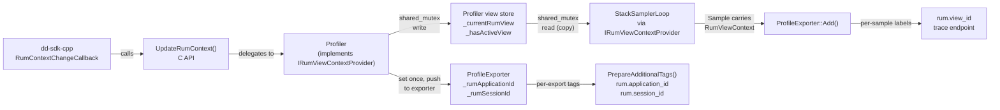

# Phase 1: dd-win-prof -- RUM Context and Per-Sample Labels

Reference: [PR #8104 plan](https://github.com/DataDog/profiling-backend/pull/8104) in profiling-backend, section "Phase 1".

## Key Assumptions

1. `application_id` and `session_id` are **set once** and never change during the process lifetime.
2. `UpdateRumContext()` with an empty/null `view_id` **clears** the current view (signals "between views").
3. The `Profiler` instance is created early (`DllMain` / `DLL_PROCESS_ATTACH`), but `ProfileExporter` is only created later in `StartProfiling()`. `UpdateRumContext()` may be called at any time after the `Profiler` instance exists.

## Data Flow




## Step 1: Define `RumContextValues` struct and C API in `dd-win-prof.h`

Add a C-compatible struct and one new exported function to the public header [dd-win-prof.h](src/dd-win-prof/dd-win-prof.h):

```cpp
typedef struct _RumContextValues
{
    const char* application_id;  // UUID string (e.g. "550e8400-e29b-41d4-a716-446655440000")
    const char* session_id;
    const char* view_id;         // nullptr or "" to clear current view
    const char* view_name;       // human-readable name, e.g. "HomePage"
} RumContextValues;
```

```cpp
DD_WIN_PROF_API bool UpdateRumContext(const RumContextValues* pContext);
```

- On first call with non-empty `application_id`/`session_id`: stores them in `Profiler` and pushes to `ProfileExporter` if it already exists (subsequent calls ignore these fields).
- On every call: updates the view-level context under a writer lock. If `view_id` is null or empty, the current view is cleared.
- Safe to call from any thread.
- No `ClearRumContext()` in the public API.

## Step 2: Create `RumViewContext`, `IRumViewContextProvider`, and wire up `Profiler` / `ProfileExporter`

### 2a. Create [src/dd-win-prof/RumContext.h](src/dd-win-prof/RumContext.h)

```cpp
struct RumViewContext {
    std::string view_id;
    std::string view_name;
};

class IRumViewContextProvider {
public:
    virtual ~IRumViewContextProvider() = default;

    // Returns true and fills 'context' with a copy of the current view if active.
    // Returns false if no view is currently active.
    virtual bool GetCurrentViewContext(RumViewContext& context) const = 0;
};
```

Header-only -- no `.cpp` needed.

### 2b. Add RUM state to `Profiler` in [Profiler.h](src/dd-win-prof/Profiler.h) / [Profiler.cpp](src/dd-win-prof/Profiler.cpp)

`Profiler` implements `IRumViewContextProvider`:

```cpp
class Profiler : public IRumViewContextProvider
{
    // ... existing members ...

    // RUM view context (dynamic, protected by reader/writer lock)
    mutable std::shared_mutex _rumViewMutex;
    bool _hasActiveView{false};
    RumViewContext _currentRumView;

    // RUM app-level IDs (write-once, buffered until exporter exists)
    std::mutex _rumAppMutex;
    bool _rumAppIdsSet{false};
    std::string _rumApplicationId;
    std::string _rumSessionId;

public:
    bool UpdateRumContext(const RumContextValues* pContext);

    // IRumViewContextProvider implementation
    bool GetCurrentViewContext(RumViewContext& context) const override;
};
```

`**Profiler::UpdateRumContext()` logic:**

1. Null-check `pContext`, return false if null.
2. Under `_rumAppMutex`: if `!_rumAppIdsSet` and `application_id`/`session_id` are non-empty:
  - Store in `_rumApplicationId`, `_rumSessionId`, set `_rumAppIdsSet = true`.
  - If `_pProfileExporter` exists, call `_pProfileExporter->SetRumApplicationTags(...)`.
3. Under `_rumViewMutex` (exclusive/writer lock):
  - If `view_id` is non-null and non-empty: set `_currentRumView.view_id`, `_currentRumView.view_name`, `_hasActiveView = true`.
  - Otherwise: clear both strings, `_hasActiveView = false`.
4. Return true.

`**Profiler::GetCurrentViewContext()` implementation:**

```cpp
bool Profiler::GetCurrentViewContext(RumViewContext& context) const
{
    std::shared_lock lock(_rumViewMutex);
    if (!_hasActiveView) return false;
    context = _currentRumView;  // copy under reader lock
    return true;
}
```

### 2c. Flush buffered app IDs when exporter is created

In [Profiler.cpp](src/dd-win-prof/Profiler.cpp) `StartProfiling()`, after creating and initializing the `ProfileExporter`:

```cpp
{
    std::lock_guard lock(_rumAppMutex);
    if (_rumAppIdsSet) {
        _pProfileExporter->SetRumApplicationTags(_rumApplicationId, _rumSessionId);
    }
}
```

### 2d. Add `SetRumApplicationTags()` to `ProfileExporter`

In [ProfileExporter.h](src/dd-win-prof/ProfileExporter.h):

```cpp
void SetRumApplicationTags(const std::string& applicationId, const std::string& sessionId);
```

Members:

```cpp
std::string _rumApplicationId;
std::string _rumSessionId;
```

The setter simply copies the strings. No synchronization needed (writes happen before the export thread's first iteration).

### 2e. Pass `IRumViewContextProvider*` to `StackSamplerLoop`

Modify the constructor in [StackSamplerLoop.h](src/dd-win-prof/StackSamplerLoop.h):

```cpp
StackSamplerLoop(
    Configuration* pConfiguration,
    ThreadList* pThreadList,
    CpuTimeProvider* pCpuTimeProvider,
    WallTimeProvider* pWallTimeProvider,
    IRumViewContextProvider* pRumViewContextProvider  // new, nullable
);
```

Store as `_pRumViewContextProvider` member. In [Profiler.cpp](src/dd-win-prof/Profiler.cpp) `StartProfiling()`, pass `this` (since `Profiler` implements the interface).

## Step 3: Implement C API function in `dd-win-prof.cpp`

In [dd-win-prof.cpp](src/dd-win-prof/dd-win-prof.cpp):

```cpp
DD_WIN_PROF_API bool UpdateRumContext(const RumContextValues* pContext)
{
    auto profiler = Profiler::GetInstance();
    if (profiler == nullptr)
    {
        return false;
    }
    return profiler->UpdateRumContext(pContext);
}
```

No logging -- just return false silently if the profiler instance doesn't exist.

## Step 4: Attach RUM view context to each `Sample`

Modify [Sample.h](src/dd-win-prof/Sample.h):

- Add a `RumViewContext _rumViewContext` member (default-constructed: both strings empty).
- Add setter `void SetRumViewContext(RumViewContext&& ctx)` and getter `const RumViewContext& GetRumViewContext() const`.

A default `RumViewContext` with empty `view_id` means "no active view" -- no need for `std::optional`.

Modify [StackSamplerLoop.cpp](src/dd-win-prof/StackSamplerLoop.cpp) `CollectOneThreadSample()`:

After creating the `Sample` object (lines 276-280 for CPU, lines 304-308 for wall):

```cpp
if (_pRumViewContextProvider != nullptr)
{
    RumViewContext rumView;
    if (_pRumViewContextProvider->GetCurrentViewContext(rumView))
    {
        sample.SetRumViewContext(std::move(rumView));
    }
}
```

- `GetCurrentViewContext()` acquires a shared lock, copies view_id + view_name, returns false if no active view.
- When it returns false, `_rumViewContext` stays default-constructed (empty strings) -- `CreateLabelSet()` will skip RUM labels.
- If `_pRumViewContextProvider` is nullptr (no RUM integration), zero overhead.

## Step 5: Add per-sample RUM labels in `ProfileExporter`

### 5a. Extend `SampleLabels` struct in [ProfileExporter.h](src/dd-win-prof/ProfileExporter.h)

Add new interned **key** IDs (keys are stable, interned once):

```cpp
struct SampleLabels {
    // ... existing fields ...
    ddog_prof_StringId rumViewIdKeyId;       // key: "rum.view_id"
    ddog_prof_StringId traceEndpointKeyId;   // key: "trace endpoint"
};
```

Add label key constants:

```cpp
static constexpr const char* LABEL_RUM_VIEW_ID = "rum.view_id";
static constexpr const char* LABEL_TRACE_ENDPOINT = "trace endpoint";
```

### 5b. Intern label **keys** in `InternSampleLabels()`

In [ProfileExporter.cpp](src/dd-win-prof/ProfileExporter.cpp), after the existing thread_name key interning (around line 735), intern `"rum.view_id"` and `"trace endpoint"` key strings. Store in `_sampleLabels.rumViewIdKeyId` and `_sampleLabels.traceEndpointKeyId`. These are interned once and reused across all samples.

### 5c. Modify `ProfileExporter::Add()` to pass RUM view context

```cpp
const auto& rumView = sample->GetRumViewContext();
ddog_prof_LabelSetId labelsetId = CreateLabelSet(_sampleLabels, threadInfo, rumView);
```

### 5d. Modify `CreateLabelSet()` to emit RUM labels

Update the signature to accept `const RumViewContext&`. After the existing thread labels (around line 783):

```cpp
if (!rumView.view_id.empty()) {
    // Intern view_id VALUE per-sample and create "rum.view_id" label
    auto viewIdValueResult = ddog_prof_Profile_intern_string(profile, to_CharSlice(rumView.view_id));
    if (viewIdValueResult.tag == DDOG_PROF_STRING_ID_RESULT_OK_GENERATIONAL_ID_STRING_ID) {
        auto viewIdLabelResult = ddog_prof_Profile_intern_label_str(
            profile, labels.rumViewIdKeyId, viewIdValueResult.ok);
        if (viewIdLabelResult.tag == DDOG_PROF_LABEL_ID_RESULT_OK_GENERATIONAL_ID_LABEL_ID) {
            labelIdArray.push_back(viewIdLabelResult.ok);
        }
    }

    // Intern view_name VALUE per-sample and create "trace endpoint" label
    if (!rumView.view_name.empty()) {
        auto viewNameValueResult = ddog_prof_Profile_intern_string(profile, to_CharSlice(rumView.view_name));
        if (viewNameValueResult.tag == DDOG_PROF_STRING_ID_RESULT_OK_GENERATIONAL_ID_STRING_ID) {
            auto endpointLabelResult = ddog_prof_Profile_intern_label_str(
                profile, labels.traceEndpointKeyId, viewNameValueResult.ok);
            if (endpointLabelResult.tag == DDOG_PROF_LABEL_ID_RESULT_OK_GENERATIONAL_ID_LABEL_ID) {
                labelIdArray.push_back(endpointLabelResult.ok);
            }
        }
    }
}
```

**Note on interning values per-sample:** Label **keys** are pre-interned once (cached in `SampleLabels`). Label **values** are interned per-sample because they vary across views. This is the same pattern as the existing `thread_name` label (line 768-780), where each thread's name is interned inline. "Intern" in pprof means "add to the string table" -- required by the format. libdatadog deduplicates internally, so samples sharing the same view won't duplicate strings.

## Step 6: Add profile-level RUM tags

Tags are emitted in `PrepareAdditionalTags()` (per-export) because app IDs are not available at exporter init time.

### 6a. Emit tags in `PrepareAdditionalTags()`

In [ProfileExporter.cpp](src/dd-win-prof/ProfileExporter.cpp) `PrepareAdditionalTags()` (line 1135):

```cpp
if (!_rumApplicationId.empty()) {
    AddSingleTag(tags, TAG_RUM_APPLICATION_ID, _rumApplicationId);
}
if (!_rumSessionId.empty()) {
    AddSingleTag(tags, TAG_RUM_SESSION_ID, _rumSessionId);
}
```

### 6b. Add tag key constants to [ProfileExporter.h](src/dd-win-prof/ProfileExporter.h)

```cpp
static constexpr const char* TAG_RUM_APPLICATION_ID = "rum.application_id";
static constexpr const char* TAG_RUM_SESSION_ID = "rum.session_id";
```

## Step 7: Unit tests

Add tests in [src/Tests/](src/Tests/):

- **Profiler RUM context tests**:
  - App IDs: set once via `UpdateRumContext()`, second call with different IDs ignored.
  - App IDs buffering: set before `StartProfiling()`, verify flushed to exporter.
  - View context: update via `UpdateRumContext()`, read back via `GetCurrentViewContext()`, verify copy semantics.
  - View clear: call with empty `view_id`, verify `GetCurrentViewContext()` returns false.
  - View atomicity: verify view_id and view_name are always read as a consistent pair.
- **Sample RUM view context**: verify sample carries the view context; verify default sample has empty view_id.
- **Label emission tests** (if feasible): verify pprof labels contain `rum.view_id` and `trace endpoint` when view is active, absent when inactive.
- **Tag emission tests**: verify `PrepareAdditionalTags()` emits `rum.application_id` / `rum.session_id` when set.

## Step 8: Integration test via Runner (scenario 5)

Add a new **scenario 5** ("RUM context") to the [Runner](src/Runner/Runner.cpp) that exercises the full RUM context pipeline end-to-end, writing pprof files locally for verification.

### 8a. Add CLI options to `RunnerOptions`

```cpp
struct RunnerOptions
{
    // ... existing fields ...
    std::string rumApplicationId;
    std::string rumSessionId;
};
```

Add `--rum-app-id <uuid>` and `--rum-session-id <uuid>` flags in `ParseCommandLine()`. These are required for scenario 5.

### 8b. Implement `RunRumScenario()` in [Runner.cpp](src/Runner/Runner.cpp)

The scenario simulates a user navigating through views:

```cpp
void SetView(const std::string& appId, const std::string& sessionId,
             const char* viewId, const char* viewName)
{
    RumContextValues ctx = {};
    ctx.application_id = appId.c_str();
    ctx.session_id = sessionId.c_str();
    ctx.view_id = viewId;
    ctx.view_name = viewName;
    UpdateRumContext(&ctx);
}

void ClearView(const std::string& appId, const std::string& sessionId)
{
    SetView(appId, sessionId, nullptr, nullptr);
}

void RunRumScenario(const std::string& appId, const std::string& sessionId)
{
    // 1. Start first view
    SetView(appId, sessionId, "11111111-1111-1111-1111-111111111111", "HomePage");
    std::cout << "View 1: HomePage (spinning 2s)..." << std::endl;
    Spin(2000);

    // 2. Clear view, then switch to second view (mimics real RUM callback pattern)
    ClearView(appId, sessionId);
    SetView(appId, sessionId, "22222222-2222-2222-2222-222222222222", "SettingsPage");
    std::cout << "View 2: SettingsPage (spinning 2s)..." << std::endl;
    Spin(2000);

    // 3. Clear view and stay idle (between views)
    ClearView(appId, sessionId);
    std::cout << "No active view (spinning 1s)..." << std::endl;
    Spin(1000);

    // 4. Start third view
    SetView(appId, sessionId, "33333333-3333-3333-3333-333333333333", "ProfilePage");
    std::cout << "View 3: ProfilePage (spinning 2s)..." << std::endl;
    Spin(2000);

    // 5. Clear view before stopping
    ClearView(appId, sessionId);
}
```

### 8c. Wire into `main()` and scenario dispatch

Update the scenario range (1-5), add scenario 5 to the dispatch `switch`, and call `RunRumScenario(opts.rumApplicationId, opts.rumSessionId)`.

Update `ShowHelp()` to document scenario 5 and the new `--rum-app-id` / `--rum-session-id` flags.

### 8d. Running the integration test

```cmd
Runner.exe --scenario 5 --iterations 1 ^
    --rum-app-id "aaaaaaaa-bbbb-cccc-dddd-eeeeeeeeeeee" ^
    --rum-session-id "11111111-2222-3333-4444-555555555555" ^
    --pprofdir C:\temp\rum-test ^
    --symbolize
```

This writes `.lz4.pprof` files to `C:\temp\rum-test`. The resulting profiles can be inspected (e.g. via `pprof` tool or the Tests pprof parser) to verify:

- Samples during View 1 have `rum.view_id = "11111111-..."` and `trace endpoint = "HomePage"`.
- Samples during View 2 have the SettingsPage labels.
- Samples during the "no view" gap have no RUM labels.
- Samples during View 3 have ProfilePage labels.
- All exported profiles have `rum.application_id` and `rum.session_id` tags.

### 8e. Update Runner README

Update [src/Runner/README.md](src/Runner/README.md) to document scenario 5 and the new flags.

## CMake Registration

- [src/dd-win-prof/CMakeLists.txt](src/dd-win-prof/CMakeLists.txt): No new source files needed (RumContext.h is header-only; changes are in existing `.cpp` files).
- [src/Tests/CMakeLists.txt](src/Tests/CMakeLists.txt): Add `RumContextTests.cpp` to the test source list.

## Files Modified (summary)

- `dd-win-prof.h` -- Add `RumContextValues` struct, `UpdateRumContext()`
- `dd-win-prof.cpp` -- Implement `UpdateRumContext()` (delegates to `Profiler`, no logging)
- `**RumContext.h` (new)** -- `RumViewContext` struct, `IRumViewContextProvider` interface (header-only)
- `Profiler.h` -- Inherit `IRumViewContextProvider`; add view context state, app ID buffering, `UpdateRumContext()`, `GetCurrentViewContext()`
- `Profiler.cpp` -- Implement `UpdateRumContext()`, `GetCurrentViewContext()`, flush buffered app IDs in `StartProfiling()`
- `StackSamplerLoop.h` -- Add `IRumViewContextProvider* _pRumViewContextProvider` parameter and member
- `StackSamplerLoop.cpp` -- Snapshot view context via provider into each Sample at collection time
- `Sample.h` -- Add `RumViewContext` member + getter/setter
- `ProfileExporter.h` -- New key IDs in `SampleLabels`, new tag constants, `_rumApplicationId`/`_rumSessionId` members, `SetRumApplicationTags()`
- `ProfileExporter.cpp` -- Intern RUM label keys, emit per-sample labels (values interned per-sample), emit per-export tags
- `Runner.cpp` -- Add scenario 5 (RUM context), `--rum-app-id`/`--rum-session-id` flags
- `Runner/README.md` -- Document scenario 5
- `src/Tests/CMakeLists.txt` -- Register `RumContextTests.cpp`
- `**RumContextTests.cpp` (new)** -- Tests for Profiler RUM context, provider interface, tags, labels

